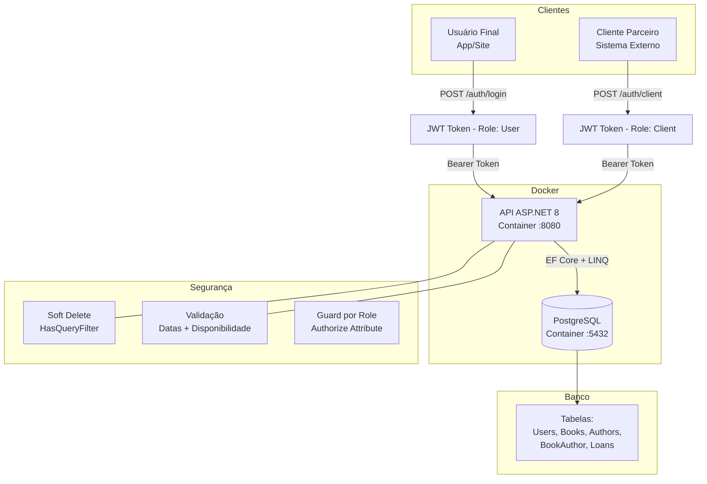

# Biblioteca


[](https://www.youtube.com/@edsonberg7658)

Uma API Backend For Frontend (BFF) para gerenciamento de biblioteca, Gerencia livros, autores e empréstimos. Usuários se cadastram, buscam livros e fazem empréstimos com data de devolução. Desenvolvida em .NET 9 com PostgreSQL, utilizando Docker para containerização.


## Vídeo demonstrativo
Neste link, mostro como a API funciona usando Swagger e como configurar após clonar

## Sobre

### Visão Geral
O Library API é um sistema completo de gerenciamento de biblioteca que atua como Backend For Frontend (BFF), fornecendo uma API robusta e escalável para aplicações cliente (web, mobile, desktop) pelo menos em teoria.

A solução foi projetada para simplificar o gerenciamento de acervos bibliográficos, permitindo que bibliotecas, escolas e instituições culturais digitalizem seus processos de empréstimo, devolução e catalogação de livros.

### Funcionalidades
- CRUD de livros: Criar, ler, atualizar e deletar livros do acervo
- Autenticação de usuários e clientes
- Catalogação de livros e seus autores
- Busca Avançada: Pesquisar por título, autor, ISBN, gênero e status

### Motivação
A crescente digitalização de bibliotecas físicas e a necessidade de sistemas acessíveis, rápidos e seguros motivaram o desenvolvimento desta API. O projeto visa:

Modernizar o gerenciamento de bibliotecas tradicionais

Facilitar o acesso dos usuários ao acervo

Automatizar processos manuais (cadastro, empréstimo, devolução)

Fornecer uma base sólida para aplicações frontend (web, mobile, etc.)

## Tecnologias

### Backend
- **.NET 9.0** - Framework principal 
- **Entity Framework Core** - ORM
- **PostgreSQL 16** - Banco de dados

### Autenticação
- **JWT** - JSON Web Tokens(Interno do C#)

### DevOps
- **Docker** - Containerização
- **Docker Compose** - Orquestração

### Ferramentas
- **Git** - Controle de versão
- **Visual Studio Code** - IDE

## Pré-requisitos

Antes de começar, você precisará ter instalado em sua máquina:

- [x] **Docker** (20.10+) e **Docker Compose** (2.0+)
- [x] **.NET 9.0 SDK** (para desenvolvimento local)
- [x] **Git (2.53.0 +)** (para clonar o repositório)
- [x] **PostgreSQL 16** (opcional, se não usar Docker)

### Verificando Instalações

```bash
# Docker
docker --version          # Deve mostrar 20.10+
docker-compose --version  # Deve mostrar 2.0+

# .NET
dotnet --version         # Deve mostrar 9.0.x

# Git
git --version            # Deve mostrar 2.x+
```

## Instalação
Crie uma pasta vazia no gerenciador de arquivos, em seguida abra com terminal de comando e clone o repositório.

## Instrução de uso

### Configure variaveis de ambiente
Após clonar o repositório, crie uma aquivo na raiz do projeto chamado .env, em seguida copie o conteúdo do .env.example para o .env, em seguida basta adicionar suas credênciais. 
    No link a seguir eu ensino no vídeo como usar (minuto:) 

### Mude o usuário do banco de dados
Seguindo as instruções anteriores sua aplicação vai iniciar como ADMIN no banco de dados, o que está correto para migrations, mas a aplicação não pode continuar como ADMIN no banco de dados.

Com os containers rodadando, abra o terminal e acesse o banco:
**psql -h localhost -p 5433 -U superuser -d biblioteca**
Ou pelo docker
**docker exec -it service psql -U superuser -d biblioteca**

Em seguida crie o o novo usuário e seus privilégios:

-- Criar usuário appuser (só leitura/escrita nos dados, sem alterar estrutura)
**CREATE USER appuser WITH PASSWORD '109486452253';**

-- Dar acesso ao banco
**GRANT CONNECT ON DATABASE biblioteca TO appuser;**

-- Dar acesso às tabelas existentes
**GRANT USAGE ON SCHEMA public TO appuser;**
**GRANT SELECT, INSERT, UPDATE ON ALL TABLES IN SCHEMA public TO appuser;**

Em seguida mude o docker compose nesta seção de:
- ConnectionStrings__DefaultConnection=${DB_CONNECTION_STRING_ADMIN}
Para:
- ConnectionStrings__DefaultConnection=${DB_CONNECTION_STRING_USER}

Por isso são definidos 2 conections string no .env.

POR FIM REINICIE O CONTAINER
Pare o container da API, e seguida você vai reinicia-lo para que as novas credênciais sejam usadas:

**docker-compose up -d api**

.Isso só reinicia o container da API se ele existir, não recria e não altera en nada o container da .

### API endpoints

Biblioteca:
GET /                         Endpoint raiz, só para ver o api funcionando

AuthClient:
POST /AuthClient/register     Cria um novo cliente  

POST /AuthClient/token        Faz uma especie de login para receber o token

POST /AuthClient/revoke/{id}  Revoga acesso de cliente(desenvolvimento)

Authors:
GET /Authors                  Busca todos os autores

POST /Authors                 Adiciona autor

GET /Authors/{id}             Busca autor por ID

PUT /Authors/{id}             Atualiza autor por ID

DELETE /Authors/{id}          Deleta autor por ID

Books:
GET /Books                    Busca todos os livros

POST /Books                   Adiciona livro

GET /Books/{id}               Busca livro por ID

DELETE /Books/{id}            Deleta livro por ID

Loans:
POST /Loans                  Adiciona/pede um empréstimo

POST /Loans/{id}/return      desenvolvimento

GET /Loans/active            Busca empréstimo ativo

Users:
POST /Users/register         Registra um usuário

POST /Users/login            Faz login de usuário(recebe token)

GET /Users/profile           Busca usuário atual

PUT /Users/profile           Atualiza usuário atual

DELETE /Users/profile        Deleta usuário atual

PUT /Users/profile/change-password  Atualiza senha do usuário atual
